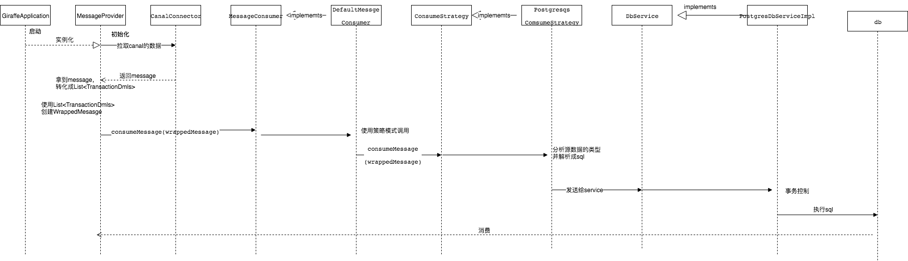

# giraffe项目介绍

#### 功能介绍

giraffe主要是通过canal定制mysql的数据，拿到数据后同步到其他的数据源，现在主要是同步到postgresql中。

#### 模块介绍

giraffe主要是分为三个模块，giraffe-launcher，giraffe-adapter，giraffe-test

- giraffe-launcher负责的功能如下：
  1. 启动项目
  2. 拉取canal的源数据
  3. 将源数据解析成自定义的公用数据，用于各个消费方进行订阅
  4. 调用接口方法消费公用数据
  5. 控制消费方的确认与回滚
  6. 控制拉取canal数据的频率，开启/关闭拉取源数据
- giraffe-adapter负责的功能如下：
  1. giraffe-adapter分为两个模块，giraffe-adapter-common，giraffe-adapter-postgres
  2. giraffe-adapter-common负责公用工具类的实现，例如，并发工具，消费通用接口，消费通用格式，数据库通用接口，通用异常
  3. giraffe-adapter-postgres主要负责实现giraffe-adapter-common的通用接口，解析insert，update，delete，alter，create table，create database，drop database，drop table，rename table这几种类型的语句到postgres中去

#### 基础框架介绍

giraffe使用了以下基础框架

- spring boot：创建独立的Spring应用程序，快速提供restapi服务
- commons-dbutils：提供操作数据库的能力，集成快速，api简单
- druid：提供数据源的能力，提供解析sql的能力
- freemarker：提供结构化sql的能力，只需要传递固定参数，就能生成sql，无需自己拼接
- ognl：提供快速获取对象任意属性和方法的能力，快速简单

#### 项目调用流程

使用[作图软件](https://www.draw.io)，打开giraffe.xml文件，可进行修改

#### 公用接口介绍

1. WrappedMessage：通过canal源数据后，转化而成的通用格式，有如下内容
   1. List<TransactionDmls>，TransactionDmls是包含一个事务的所有数据，一个TransactionDmls包含如下数据
      1. List<DataDml>，一条DataDml是一条数据
   2. batchId：本次拉取的id
2. MessageConsumer：通用的消费接口，参数是WrappedMessage，以后添加其他消费方，就实现此接口，并在MessageProvider进行注入即可
3. ConsumeStrategy：消费的策略接口，可能有不同的消费方式，所以可能会注入不同的消费策略，而且可以在MessageConsumer的实现类中，其他不同的方法，类似代理模式，让ConsumeStrategy更加专注于消费功能的实现
4. DataDmlHandler：将每一条DataDml的转换成sql，在PostgresDataDmlHandler实现类下，转换成postgres数据库类型的List<sql>,源数据虽然只有一条，但是转换时可能有多条语句
5. DbService：执行批量的sql，建议在实现类中，实现事务的控制

####  使用到的设计模式

1. 策略模式，使用场景在消费者中提供一个策略的接口，实际的策略由调用方进行控制，消费者相当于是context

#### restapi介绍

| api                              | 访问格式 | 描述              |
| -------------------------------- | ---- | --------------- |
| http://localhost:8080/getRunning | post | 获取当前拉取的线程是否还在运行 |
| http://localhost:8080/run        | post | 运行任务            |
| http://localhost:8080/stop       | post | 停止任务            |

#### 扩展阅读

> [OGNL 语言介绍与实践](https://www.ibm.com/developerworks/cn/opensource/os-cn-ognl/index.html)

> [Druid SQL 解析器](https://www.jianshu.com/p/437aa22ea3ca)

> [Apache的DBUtils框架学习](https://www.cnblogs.com/xdp-gacl/p/4007225.html)

> [FreeMarker 快速入门](https://segmentfault.com/a/1190000011768799)

> [策略模式](https://www.runoob.com/design-pattern/strategy-pattern.html)